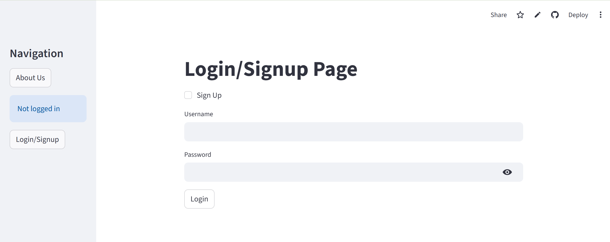
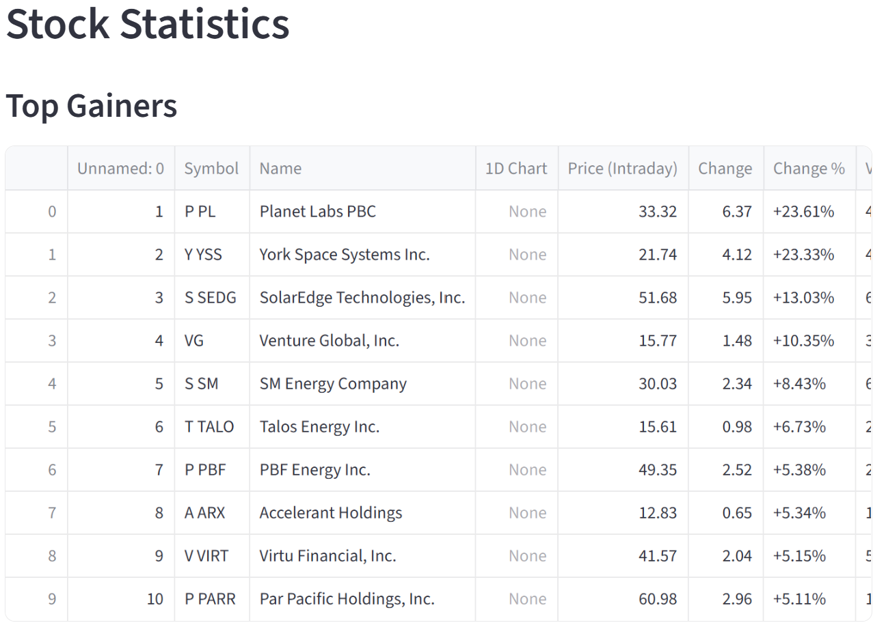
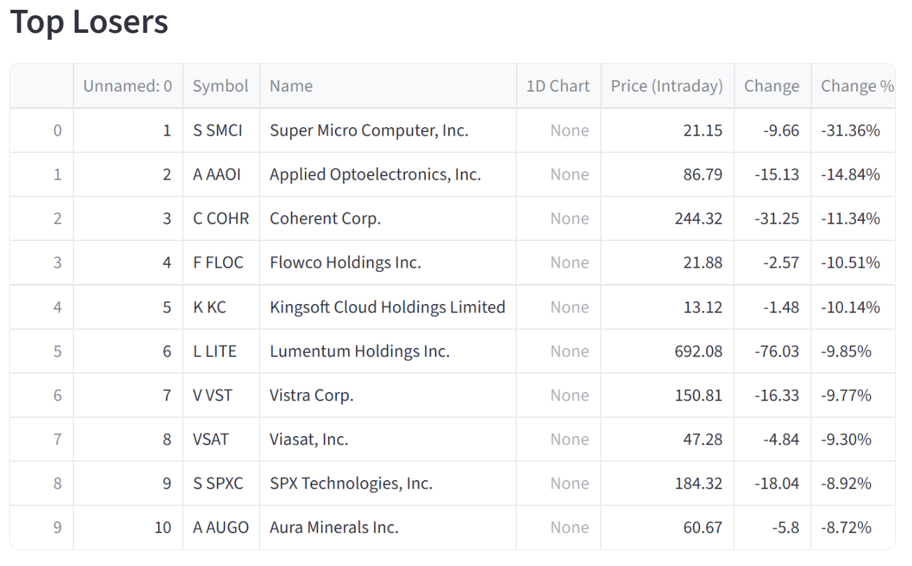
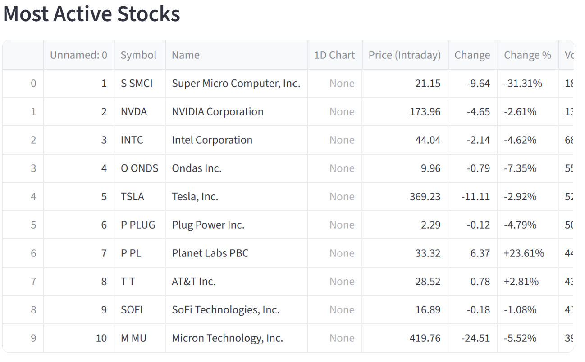
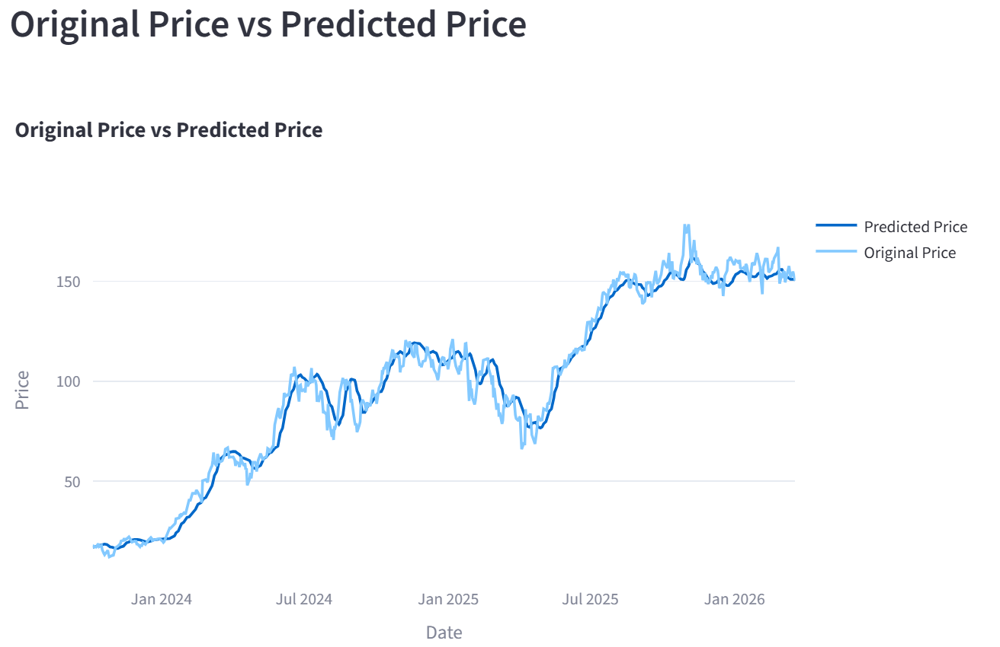

# 📈 Stock Price Prediction & Analytics Platform

A Streamlit-based web application for stock analysis and prediction using machine learning.

## 🚀 Live Demo
👉 https://stock-price-predictor-iua23tgvz4wfslmwwncq3a.streamlit.app/

## Project Overview

This project allows users to:

- Sign up and log in securely
- View Top Gainers, Top Losers, and Most Active Stocks
- Search stocks by symbol
- Analyze historical stock trends
- View moving average charts
- Compare predicted vs actual stock prices

## Features

- User Authentication using SQLite and Passlib
- Stock Search by Symbol
- Stock Statistics Dashboard
- Interactive Charts using Plotly
- LSTM-based Stock Prediction
- Streamlit-based Web Interface
- Live Deployment

## Tech Stack

- Python
- Streamlit
- TensorFlow / Keras
- Pandas
- NumPy
- Plotly
- SQLite
- Passlib
- Yahoo Finance Data

## Project Structure
```
stock-price-predictor/
│── application/
│   ├── app.py
│   ├── model/
│   │   └── Stock Prediction Model.keras
│── notebooks/
│   └── Prediction Model.ipynb
│── requirements.txt
│── README.md
```
---

## 📸 Screenshots

### 🔐 Login Page


---

### 📊 Stock Dashboard

#### Top Gainers


#### Top Losers


#### Most Active Stocks


---

### 📈 Prediction Output


---