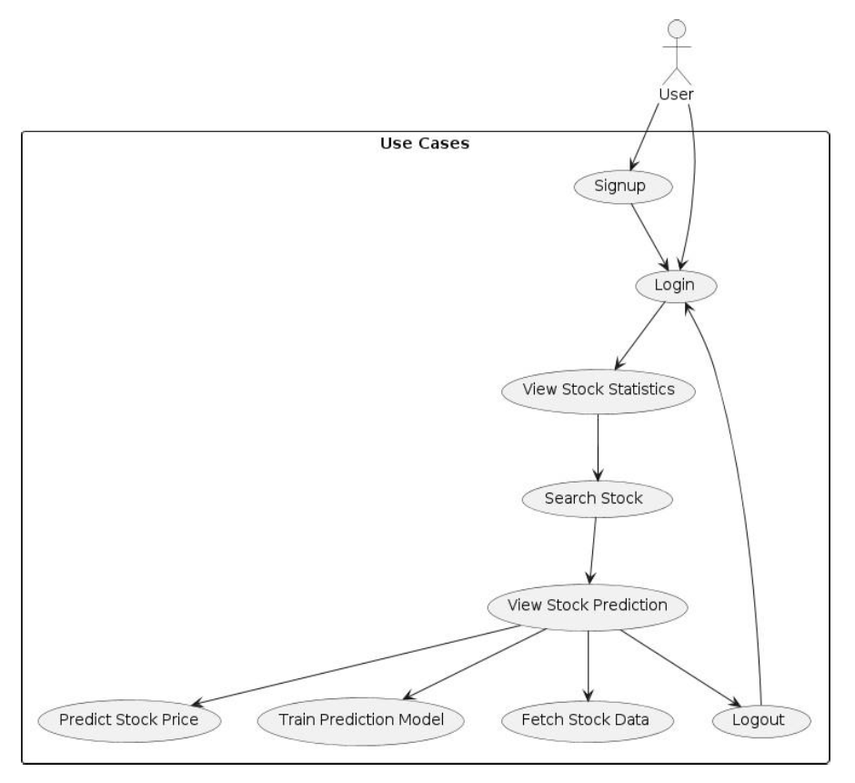
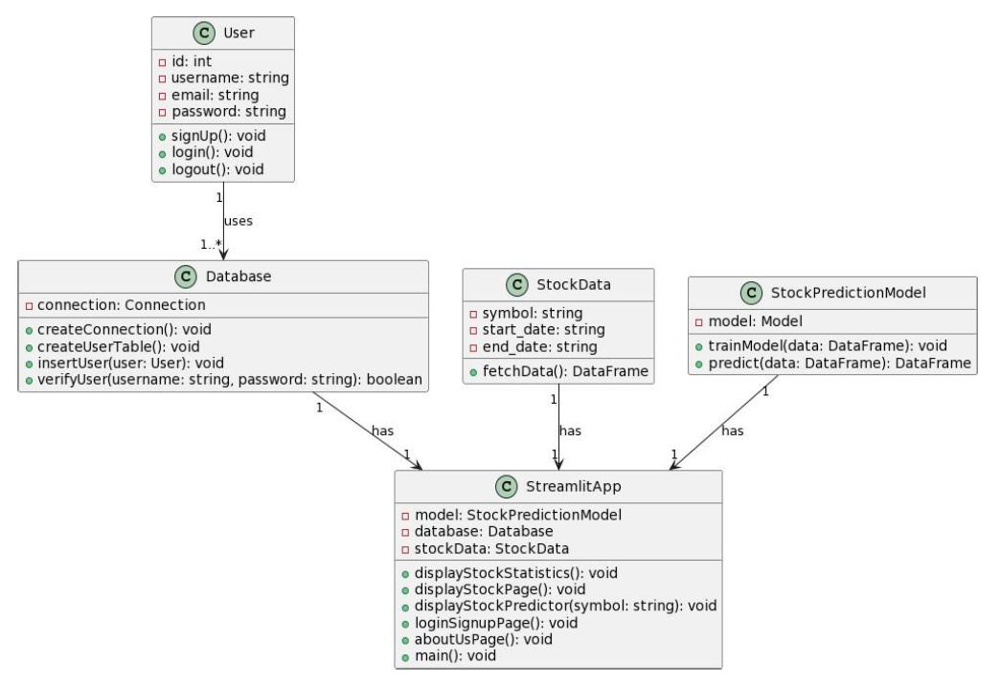

# 📊 Stock Price Prediction & Analytics Platform

## 1. Introduction

Financial markets generate large volumes of data through stock price movements, trading activity, and market trends. However, analyzing this data effectively requires proper tools for visualization and interpretation.

This project presents a Stock Price Prediction & Analytics Platform that allows users to explore stock market data through interactive visualizations and machine learning-based analysis.

The goal of the project is to analyze historical stock price data, visualize trends using technical indicators, and evaluate model performance by comparing predicted prices with actual prices.

The application is deployed as a web-based platform using Streamlit.

---

## 2. Data Source

The stock data used in this project is obtained from Yahoo Finance.

The dataset includes:

- Historical stock prices (Open, High, Low, Close)
- Trading volume
- Time-series data based on dates

Instead of using official APIs, stock data is fetched using HTTP requests and parsed into structured format. This approach ensures reliable data access in both local and deployed environments.

---

## 3. Data Preparation

Before analysis and modeling, the data undergoes preprocessing.

The following steps were performed:

- Conversion of raw data into structured time-series format  
- Removal of missing or null values  
- Standardization of column names  
- Selection of closing price as the main feature  
- Scaling of data using MinMaxScaler  

The processed dataset is then used for visualization and model evaluation.

---

## 4. System Overview

The system consists of the following components:

- **Frontend:** Streamlit-based web interface  
- **Backend:** Python for data processing and logic  
- **Machine Learning Model:** LSTM for time-series analysis  
- **Database:** SQLite for user authentication  
- **Data Retrieval:** Yahoo Finance data using HTTP requests  

Users can log in, search stocks, view market statistics, and analyze stock trends.

---

## 5. Features

- User authentication (Login/Signup)  
- Stock search functionality  
- Market statistics:
  - Top Gainers  
  - Top Losers  
  - Most Active Stocks  
- Interactive visualizations using Plotly  
- Moving average analysis (MA50, MA100, MA200)  
- Comparison of predicted vs actual stock prices  
- Deployed web application  

---

## 6. Machine Learning Model

The project uses an LSTM (Long Short-Term Memory) model for time-series analysis.

Model details:

- Input: Historical closing prices  
- Data split: 80% training, 20% testing  
- Scaling technique: MinMaxScaler  
- Sequence window: Previous 100 days  

The model is used to analyze patterns in stock price movements and evaluate its performance by comparing predicted values with actual values.

---

## 7. Visualization & Analysis

The platform provides multiple visualizations:

- Price vs Moving Average (MA50)  
- Price vs MA50 vs MA100  
- Price vs MA100 vs MA200  
- Predicted vs Actual Price comparison  

These visualizations help users understand trends and evaluate how closely the model aligns with actual stock data.

---

## 8. System Design

### Use Case Diagram

The Use Case Diagram represents how users interact with the system.

- The primary actor is the **User**
- The user can:
  - Sign up and log in to the system  
  - View stock statistics (Top Gainers, Losers, Most Active)  
  - Search for a specific stock  
  - View stock prediction analysis  
  - Logout from the system  

The diagram also shows system-level operations such as:
- Fetching stock data  
- Processing data for analysis  
- Displaying prediction results  

This diagram provides a high-level overview of user interactions and system functionalities.

---

### Class Diagram

The Class Diagram represents the internal structure of the system.

Main components include:

- **User**
  - Stores user details such as username, email, and password  
  - Handles authentication functions like signup, login, and logout  

- **Database**
  - Manages SQLite connection  
  - Handles user-related operations such as inserting and verifying users  

- **StockData**
  - Responsible for fetching stock data  
  - Stores symbol, date range, and retrieved data  

- **StockPredictionModel**
  - Contains the trained LSTM model  
  - Performs prediction on processed stock data  

- **StreamlitApp**
  - Acts as the main controller of the application  
  - Integrates all components  
  - Handles UI rendering and user interactions  

The relationships between classes show how different components interact to build the complete system.

This diagram provides a clear understanding of system architecture and data flow.

---

## 9. Challenges Faced

- Issues with stock data fetching in cloud deployment  
- Instability of third-party libraries like yfinance  
- Managing navigation and session state in Streamlit  
- Ensuring consistent data retrieval  

---

## 10. Solutions Implemented

- Replaced yfinance with direct HTTP-based data fetching  
- Used Streamlit session state for smooth navigation  
- Structured data processing pipeline for stability  
- Improved deployment reliability  

---

## 11. Results

The final system successfully:

- Displays real-time stock market statistics  
- Provides interactive visualizations  
- Compares predicted and actual stock prices  
- Works reliably in deployed cloud environment  

---

## 12. Conclusion

This project demonstrates how stock market data can be analyzed using machine learning and visualization techniques.

By combining LSTM-based modeling with interactive dashboards, the system provides a practical way to understand stock trends and evaluate model performance.

The project highlights real-world application development using data processing, machine learning, and web deployment.